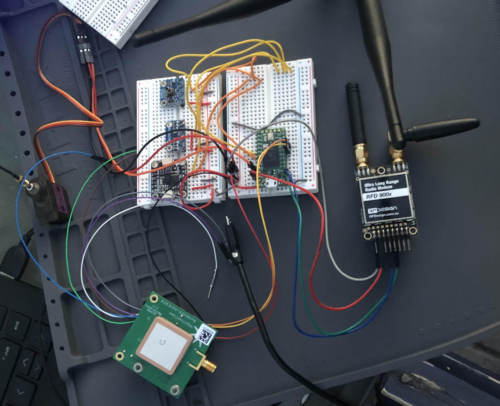
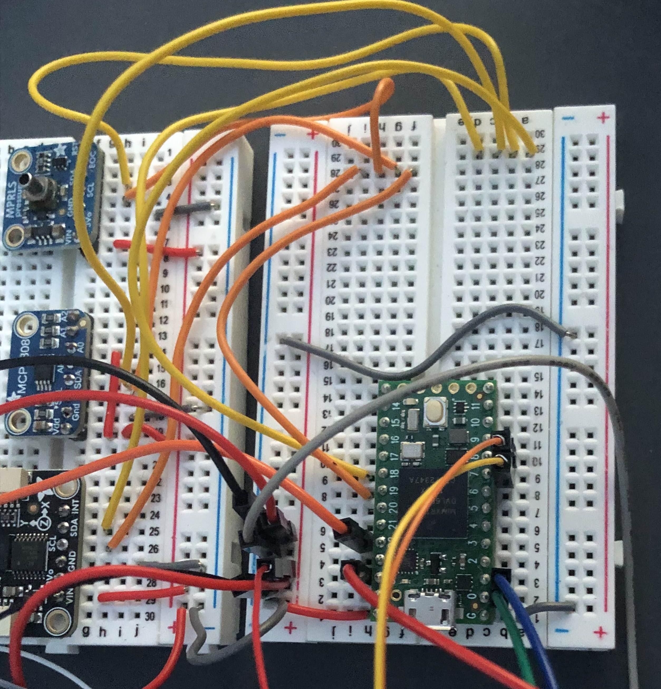
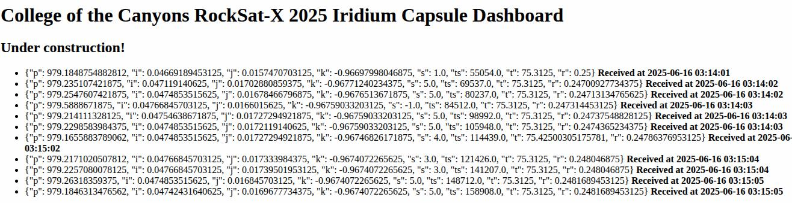

# PHAROS Capsule.ino EXPLAINED

This is the code used by the PHAROS capsule. 

Currently, it still needs to have the PHAROS gyro code added to the `moveCapsule()` function, but it's been tested and works for data collection and COMMS funcitonality.

## CAPSULE LOGIC


The PHAROS capsule houses 3 sensors:

- **BNO085 9-DOF IMU** Used to gather capsule positional data [Link to documentation](https://cdn-learn.adafruit.com/downloads/pdf/adafruit-9-dof-orientation-imu-fusion-breakout-bno085.pdf)

- **MCP9808 Temperature Sensor** Used for accurate/precise temperature measurement [Link to documentation](https://learn.adafruit.com/adafruit-mcp9808-precision-i2c-temperature-sensor-guide/overview)

- **MPRLS Pressure Sensor** Used to measure temperature [Link to documentation](https://learn.adafruit.com/adafruit-mprls-ported-pressure-sensor-breakout/overview)

These are connected--via I2C--to a Teensy 4.0. Twice per second, the Teensy gathers data from these sensors and sends them:

- **via RFD900x**: to the RFD900x mounted on the ATLAS/PHAROS payload deckplate. The data is then transmitted to a Teensy 4.1 on the deckplate that decodes it and stores it as a `.jsonl` file onto an SD card. [SEE PAYLOADRFD.INO FOR MORE INFO](../Payload/PayloadRFD.ino)

- **via RockBlock (if signal quality allows):** to the Iridium Satellite Network, where it is then passed onto an AWS Flask Server, which decodes and stores the data in a sqlite database.

In addition, the Capsule is constantly running a servo and DC motor in order to self-adjust its position. 


## THREADING OVERVIEW

Threading was used to ensure all three functions are able to run simultaneously (and not hold one another up).

There are three threads:

- **Sensor & RFD Thread:** Collects sensor data and sends it via RFD900x.

- **RockBlock Thread:** Shares data with the Sensor & RFD Thread. Checks to see if new data has been collected and, if so, sends it via RockBlock to the Iridium Satellite Network.

- **ServoThread:** Used to run the continuously adjusting servo script. Currently needs to be updated.

Please note that the data being collected is compressed and encoded by MessagePack. 


## DATA FLOW

- Sensor & RFD Thread serializes sensor reading via MessagePack and sends them to the payload via RFD900x. Updates this data to a shared buffer that's protected by a mutex.

- RockBlock thread notices the shared buffer is updated and sends it over satellite. 

- Servo thread is independent and runs continuously. 


## FREQUENCY INFORMATION

**RFD900x** 920-928MHz

**RockBlock** 1616-1626.5 MHz

These have been tested in close proximity to one another without any adverse affects. 


## BAUD INFORMATION

Currently, the code is set up to work on a Teensy 4.0 such that

**SERIAL** Used by Serial Monitor; 9600 baud

**SERIAL1** Pins 0 and 1; Used by RFD 900x; 57600 baud

**SERIAL2** Pins 7 and 8; Used by RockBlock; 19200 baud






## EXAMPLE OPERATION

<video width="320" height="240" controls>
  <source src="./IMGS/COMMS_ExampleOperation.mov" type="video/mp4">
</video>

<video width="320" height="240" controls>
  <source src="./IMGS/COMMS_ExampleOperation2.mov" type="video/mp4">
</video>


## AWS CONNECTION

The Rockblock has been configured to send data to an AWS EC2 Flask Server.

**IMPORTANT** Every time you stop and restart an EC2 instance, the public facing IP will change. You'll need to update the RockBlock Admin with the new IP. 

The data sent by the Iridium Satellite Network to the server looks like this:

```
{'iridium_session_status': 0, 'momsn': 23, 'data': '436865636b696e672066726f6d207363686f6f6c21', 'serial': 224876, 'iridium_latitude': 34.3977, 'iridium_cep': 6.0, 'JWT': xbExTLAmO7qTnYdzgKGhi6j7wb8j37tHlu3ZNKDPhXiPY07ziJG482jY978JmjQahgWwUImnVeWVRL_L30BUifLgEqnwjVn7Q0oK2iUu5GdcBS7g0o9LfUVzgpYDZo1t8m3rUWX3IbSifTtn97Laiw7A4tOINGaCCCtCVvojeeH58pZxngm_k6KxYgpsluRSpisCcrtUAHkwHnNi2U4b493UJhFkjhxObw', 'device_type': 'ROCKBLOCK', 'transmit_time': '25-06-14 18:08:23', 'iridium_longitude': -118.5514}
```

**IMPORTANT** Note that the Iridium Satellite Latitude and Longitude are in this JSON, so you could capture and use this for the dashboard if you like!

**CODE FOR THE AWS EC2 FLASK INSTANCE CAN BE FOUND:** [HERE](https://github.com/dsp-mark/RSX-2025_IridiumDB)

If you create your own EC2 instance, you can git clone this, `cd` into the folder, run `python3 -m venv venv`, `pip install -r requirements.txt`, and then `python app.py` to get it started. It's set up to run with a simple Free Tier Ubuntu EC2 instance. 

Currently, the page is simple and just presents a list of all the data it's received, decoded, and stored in its sqlite database (as well as the times it added them).




## SD STORAGE ON PAYLOAD

For reference, the Teensy 4.1 on the payload will store the capsule data it receives onto an SD card. It saves the data onto a `.jsonl` file. Code to display the `.jsonl` file can be found in the `Post-Launch/PostLaunchViewPharosSDData.py` file.


## THINGS TO LOOK OUT FOR

- Make sure the MCP9808 Temperature sensor has the A0 connected to the VIN/VDD so it's address changes to `0x19`. By default, it shares an I2C address with the MPRLS, so if these aren't connected, it will cause problems with reading the sensor.

- Make sure the patch antenna of the RockBlock is facing the sky.

- Make sure the lights on the RFD900x's are blinking red when both are on. This means they're connected and recognize each other.

- Make sure an AWS EC2 instance is running **AND** that the public IP of the instance has been added to the RockBlock Admin delivery groups as `http://{Public IP here}:5000/raw_iridium`

- Make sure the RockBlock Admin has the line paid for and has enough credits for the launch

- MAKE SURE TO UPDATE `moveCapsule()` FUNCTION WITH THE ACTUAL GYRO CODE THAT WILL BE USED


## DOCUMENTATION THAT MIGHT BE HELPFUL

[RFD900X](https://files.rfdesign.com.au/docs/)

[ROCKBLOCK](https://docs.groundcontrol.com/iot/rockblock)

[ROCKBLOCK ADMIN](https://rockblock.rock7.com/Operations#)

[IRIDIUMSBD LIBRARY](https://github.com/mikalhart/IridiumSBD)

[TEENSYTHREADS](https://github.com/ftrias/TeensyThreads)

[MESSAGEPACK](https://msgpack.org/index.html)

[SQLITE](https://www.sqlite.org/docs.html)

[SQLITE TUTORIALS](https://www.sqlitetutorial.net/)

[SQLITE VIEWER](https://sqliteviewer.app/)