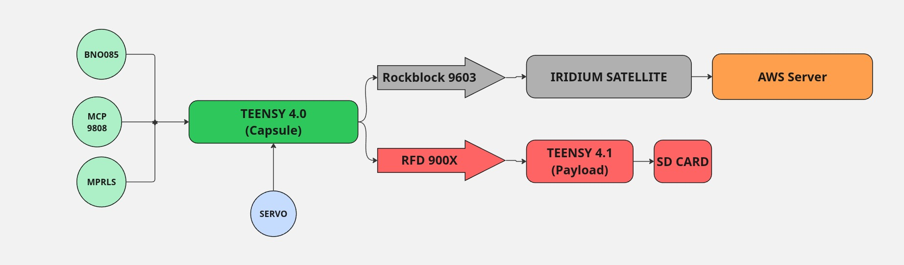
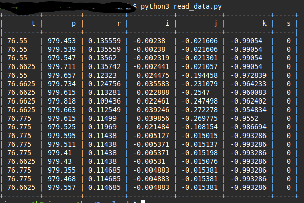

# PHAROS PayloadRFD.ino EXPLAINED

This is the COMMS side of the code used by the PHAROS payload Teensy 4.1. 

The Teensy 4.1 on the payload actually manages several other things--such as capsule deployment. However, this code is focused on the COMMS side of things: Receiving data and storing it on an SD Card.

## CAPSULE LOGIC

The PHAROS capsule houses 3 sensors:

- **BNO085 9-DOF IMU** Used to gather capsule positional data [Link to documentation](https://cdn-learn.adafruit.com/downloads/pdf/adafruit-9-dof-orientation-imu-fusion-breakout-bno085.pdf)

- **MCP9808 Temperature Sensor** Used for accurate/precise temperature measurement [Link to documentation](https://learn.adafruit.com/adafruit-mcp9808-precision-i2c-temperature-sensor-guide/overview)

- **MPRLS Pressure Sensor** Used to measure temperature [Link to documentation](https://learn.adafruit.com/adafruit-mprls-ported-pressure-sensor-breakout/overview)

These are connected--via I2C--to a Teensy 4.0. Twice per second, the Teensy gathers data from these sensors and sends them:

- **via RFD900x**: to the RFD900x mounted on the ATLAS/PHAROS payload deckplate. The data is then transmitted to a Teensy 4.1 on the deckplate that decodes it and stores it as a `.jsonl` file onto an SD card. **That's what this code does.**

- **via RockBlock (if signal quality allows):** to the Iridium Satellite Network, where it is then passed onto an AWS Flask Server, which decodes and stores the data in a sqlite database.

In addition, the Capsule is constantly running a servo and DC motor in order to self-adjust its position. 

The code for the capsule can be found [HERE](../Capsule/Capsule.ino).

The code for the AWS EC2 Flask server can be found [HERE](https://github.com/dsp-mark/RSX-2025_IridiumDB).

## DATA FLOW

**CAPSULE**

- Sensor & RFD Thread serializes sensor reading via MessagePack and sends them to the payload via RFD900x. Updates this data to a shared buffer that's protected by a mutex.

- RockBlock thread notices the shared buffer is updated and sends it over satellite. 

- Servo thread is independent and runs continuously. 

**PAYLOAD**

- Payload RFD900x receives message from the capsule. 

- Message is decoded.

- Message is appended onto `pharosData.jsonl`, which is a `.jsonl` file stored on the SD card.

## BAUD INFORMATION

Currently, the code is set up to work on a Teensy 4.1 such that

**SERIAL** Used by Serial Monitor; 9600 baud

**SERIAL1** Pins 0 and 1; Used by RFD 900x; 57600 baud

## EXAMPLE OPERATION

<video width="320" height="240" controls>
  <source src="../Capsule/IMGS/COMMS_ExampleOperation.mov" type="video/mp4">
</video>

<video width="320" height="240" controls>
  <source src="../Capsule/IMGS/COMMS_ExampleOperation2.mov" type="video/mp4">
</video>

## SD STORAGE

The Teensy 4.1 on the payload will store the capsule data it receives onto an SD card. It saves the data onto a `.jsonl` file. Code to display the `.jsonl` file can be found in the `Post-Launch/PostLaunchViewPharosSDData.py` file.

## THINGS TO LOOK OUT FOR

- Make sure you're using a Teensy 4.1--this code is set to work with Teensy 4.1's inbuilt SD card reader.

- Make sure the SD card you're using is less than 8GB. Anything larger will often give you an error.

- Make sure the lights on the RFD900x's are blinking red when both are on. This means they're connected and recognize each other.

## DOCUMENTATION THAT MIGHT BE HELPFUL

[RFD900X](https://files.rfdesign.com.au/docs/)

[MESSAGEPACK](https://msgpack.org/index.html)